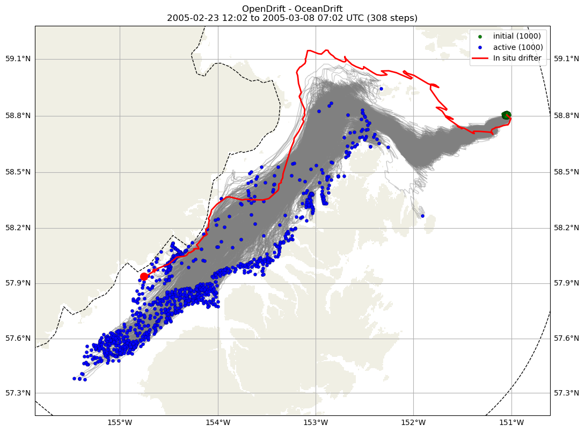

(page:drifter_description)=
# Overview of Drifter Simulations

Particle simulations are run to match each available drifter dataset: `drifters_ecofoci` and `drifters_uaf`. 

## Simulation Setup

The simulated particle simulations are run with the following conditions:

* Start the simulated particles at the *in situ* drifter location in the CIOFS domain and in a radius 500m around that location.
* Start the simulated particles at the time the drifter is at that location in the CIOFS domain, but starting 40 minutes before and every time step through 40 minutes after. See immediately below for details.
* Start the simulated particles at the same depth that the *in situ* drifter is drogued, and run them fixed to that depth.
* Run 1000 simulated particles.
* Use time-varying masks from ROMS if the drifter is shallower than the tidal flats ($5m$), otherwise use static versions to save time.
* Use estimate of horizontal diffusivity in `particle-tracking-manager` which is calculated as $0.1 m/s$ sub-gridscale velocity that is missing from the model output and multiplied by an estimate of the horizontal grid resolution. The horizontal grid resolution is variable but is approximated as $100 m$ so that the horizontal diffusivity is calculated as $0.1 m/s$ * $100 m$ = 10 $m^2$/s. This has not been tuned but instead is a theoretical calculation.

The timing of how out to extend the simulation timing before and after the *in situ* drifter was based on the HF Radar comparisons in the CIOFS Hindcast Report {cite:p}`ciofs_hindcast`. On the [HF Radar comparison page](https://ciofs.axds.co/outputs/pages/comparison/hfradar/hfradar.html), the tidal phase difference of the data minus the model is plotted on the far right side of each of the two figures, each for two different time periods for HF Radar data. The $M_2$ tide is the dominant tide in the region. 


Taking the maximum phase difference seen in the plot of about 20 degrees, we use the relationship based on the fact that the $M_2$ tide repeats every 12 hours and 25 minutes:

$\frac{360^\circ}{12 hr 25 min} = \frac{20^\circ}{x} $

This phase difference between the model and the data gives us a time difference of 41.4 minutes, or about 40 minutes. We use this time scale both backward and forward in time with our simulation start times.


## Metrics

We use two metrics to assess the performance of the model in capturing the drifter movements: an area-based metric and a separation distance-based metric. We will use an example simulation shown here to explain each metric, where the gray lines show the 1000 simulated particles with the green circles showing their initial locations and blue circles showing their final locations, and the single red line shows the *in situ* drifter with the red circle showing its final location (at least in the domain, it may continue farther, outside the domain). The dashed black line shows an estimated model domain boundary.

```{figure} ../CIOFS/53298_y2005.png
---
name: fig-CIOFS/53298_y2005
---
Example particle simulation (EcoFOCI 53298_y2005).
```
<!--  -->


### Area-Based Length Scale


The normalized length-scale metric $L$ compares the behavior of the group of simulated particles with the *in situ* drifter, with the idea that no single simulated drifter track is more representative than another. The distance from the drifter to the envelope of simulated particles represents how well the model captures the drifter's movement, and is 0 if the drifter is within the Qhull of the simulated particles. This length scale is normalized by the square root of the area of the same Qhull, which is the dispersion of the particles and therefore gives a lengthscale for the flowfield at the same time.

$ L_i = \frac{d^{Qhull}_i}{\sqrt{A^{Qhull}_i}} $

for $i$ from times 1 to $N$. For example, in the image we see how this is calculated at a particular time step overlaid on a representation of particle simulations. At the time shown, the drifter locations are in blue circles, and the envelope or Qhull they create is outlined in blue. The shortest distance from that polygon to the present *in situ* drifter location (red circle) is represented by a dashed blue line, which is the numerator of $L$. The square root of the area within the blue polygon is the denominator of $L$. This is calculated for each time step of the drifter simulation.

```{figure} ../CIOFS/53298_y2005_example_qhull_max.png
---
name: fig-CIOFS-53298_y2005_example_qhull_max
width: 60%
---
Diagram explaining the area-based length scale (EcoFOCI 53298_y2005 as example).
```

For this example, the calculation of $L$ for the full set of time are in the following image, with the time of comparison noted with the vertical dashed blue line. Comparing with the image of the full set of simulation tracks above, one can see that the time of comparison was chosen to be the time of maximal excursion of the simulated particles away from the *in situ* drifter. A horizontal line marks the value of $L=1$ since that is when the length scale of the Qhull away from the drifter equals the length scale of the particle dispersion. When $L>1$, the particle Qhull and drifter are farther apart than the dispersion length scale, and thus the model is performing worse compared to this measure.

```{figure} ../CIOFS/53298_y2005_ss_qhull.png
---
name: fig-CIOFS-53298_y2005_ss_qhull
width: 60%
---
Area-based length scale over time for example drifter and particle simulations EcoFOCI 53298_y2005.
```


The length scale metric $L$ is converted into a skill score by adding over the time frame, dividing by the number of time steps to create a mean, and subtracting it from 1:

$ ss_L = 1 - \frac{1}{N} \Sigma^N_{i=1} L_i $.

When $0 < ss_L \le 1$, the simulated particle cloud is capturing the *in situ* drifter within the cloud with some skill, particularly if $0.5 \le ss_L \le 1$. There can be scenarios in which $ss_L<0$ due to the way it is calculated, in which case, the model is not demonstrating skill. Note that the skill score for this example is shown in the title of the image and in this case it is $ ss_L = 0.75$.


### Separation Distance

The separation distance is proposed in {cite:t}`liu_weisberg` as a way to compare modeled particles against *in situ* drifters 1 to 1 and to be able to interpret the full time series without having separations early in the time series pollute the interpretation later in the time series. The way they manage this is by having both the numerator and the denominator be cumulative calculations. The separation distance $s$ is calculated as:

$ s_i = \frac{\Sigma^i_{j=1}d_j}{\Sigma^i_{j=1}\ell_j} $

for $i$ from times 1 to $N$, and where $d_j$ is the distance between a simulated particle and the *in situ* drifter at time $j$ between 1 and $i$, and $\ell_j$ is the distance traveled along the *in situ* drifter trajectory at time $j$. To help understand the separation distance, two drifters are pulled out as examples in particular in the image: the *in situ* drifter in red and a simulated particle track in purple. At the time shown, they have each reached to an extent marked by circles, having traveled along the paths indicated by matching colors, and occasionally marked by circles to represent previous time steps, pretending that there were only a few time steps for demonstration purposes. The separation distance is calculated as the summation of the distance between the drifters at each time up to this point in time divided by the summation of the distance traveled by the *in situ* drifter from start up each time up to this point:

$ s_6 = \frac{d_1 + d_2 + d_3 + d_4 + d_5 + d_6}{\ell_1 + \ell_2 + \ell_3 + \ell_4 + \ell_5 + \ell_6} $,

but remember that $\ell_j$ are the total distance from the start of the drifter track to the time it is counting.


```{figure} ../CIOFS/53298_y2005_example_sep_max_annotated.png
---
name: fig-CIOFS-53298_y2005_example_sep_max_annotated
width: 60%
---
Diagram explaining the separation distance (EcoFOCI 53298_y2005 as example).
```


The full time series of the separation distance for the example is shown in the following image. The time shown in the previous plot is noted with a vertical dashed line. The time shown is a time when the *in situ* drifter and comparison simulated particle were the farthest apart for the simulation. The separation distance can be converted into a skill score by taking the root mean square error over the times available as follows:

$ ss_s = 1 - \frac{1}{N}\Sigma^N_{i=1} \sqrt {s_i^2} $.

The skill score can be negative but must be positive to display skill in recreating the drifter behavior; closer to 1 is better skill with 1 being perfect skill.


```{figure} ../CIOFS/53298_y2005_ss_sep.png
---
name: fig-CIOFS-53298_y2005_ss_sep
width: 60%
---
Separation distance over time for example drifter and particle simulations EcoFOCI 53298_y2005.
```

The separation distance is calculated between each simulated drifter and the *in situ* drifter. We present two specific simulated particles: the minimum and the mean separation distance, as calculated from the root mean square. These are the two tracks highlighted in the example image, and the two skill scores given in the results. Note that the skill score is given in the image title and is $ss_s = 0.82$ for the minimum separation distance (which is the maximum skill score) and $ss_s=0.74$ for the mean separation distance (which is the mean skill score).

